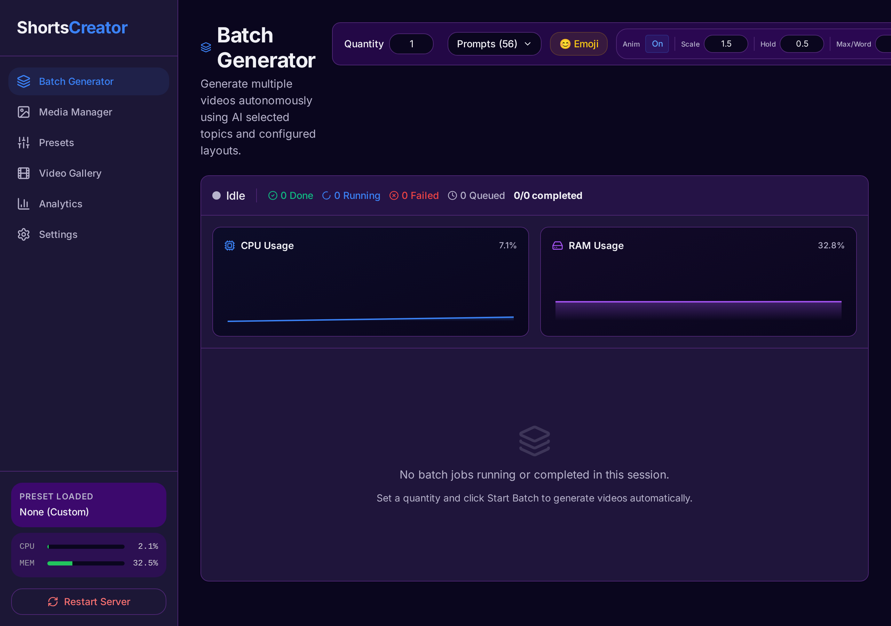
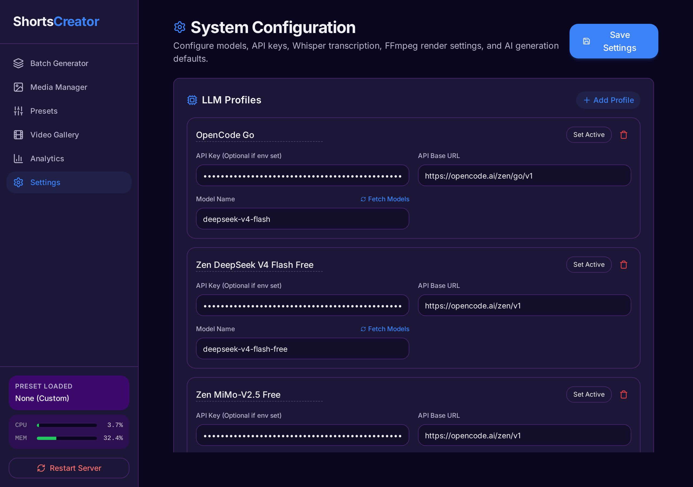
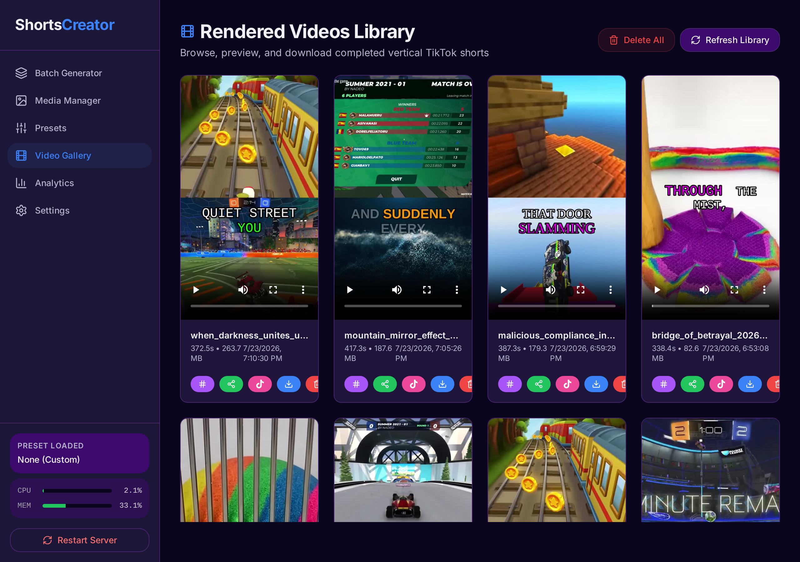

<picture>
  <source media="(prefers-color-scheme: dark)" srcset="docs/screenshots/batch.png">
  
</picture>

# Shorts for Sorts

**AI-powered short-form video generator.** Create TikTok and YouTube Shorts at scale with LLM-written scripts, AI voiceovers, background videos, music, and animated subtitles.

---

## Features

- **Batch video generation** — Generate 1–50 shorts in a single run with automatic retry, timeout, and failure mode controls
- **LLM script writing** — Uses OpenAI-compatible APIs (GPT-4o, DeepSeek, etc.) including free Zen models. Supports custom system prompts, temperature, and prompt templates
- **AI text-to-speech** — On-device Kokoro ONNX TTS engine with 20+ voices. No cloud dependency
- **Speech recognition** — Faster-Whisper for automatic subtitle alignment (local or API)
- **FFmpeg video composition** — Background videos, music overlay, animated subtitles with word highlighting, emojis, and customizable styles
- **Real-time progress** — WebSocket-powered live updates with ETA, per-job progress segments (LLM → Voice → Transcribe → Render)
- **Asset management** — Upload/download background videos & music, search and download from Pexels and YouTube, auto-resolve "random" mode
- **Preset system** — Save and reuse video configurations (voice, subtitles, layout, music)
- **TikTok integration** — Direct upload to TikTok from the gallery
- **Analytics dashboard** — Charts for batch performance, phase timing, per-job statistics (Recharts)
- **Dark/Light mode** — Theme switching with next-themes
- **Error monitoring** — Optional Sentry integration

---

## Screenshots

| Batch Generation | Settings Configuration | Gallery |
|---|---|---|
|  |  |  |

---

## Quick Start

```bash
bash run-gui.sh
```

This single command:
1. Creates a Python virtual environment (if missing)
2. Installs Python dependencies
3. Installs frontend Node.js dependencies and builds the SPA
4. Generates a self-signed SSL certificate (for HTTPS)
5. Starts the server on `https://0.0.0.0:5000`

Open your browser to `http://localhost:5000` (or `https://localhost:5000`).

> **Prerequisites:** Python 3.10+, FFmpeg, and Node.js (for frontend dev/build).

---

## Manual Setup

### 1. Backend

```bash
python3 -m venv venv
source venv/bin/activate
pip install -r requirements.txt
```

### 2. Frontend (development)

```bash
cd gui/frontend
npm install
npm run dev    # starts Vite dev server on :5173
```

The Vite dev server proxies API calls to the Python backend at `:5000`.

### 3. Run the server

```bash
python gui/server.py
```

Or with HTTPS:

```bash
python gui/server.py --https
```

---

## Usage

### Pages

| Page | Route | Purpose |
|---|---|---|
| **Batch** | `/` or `/batch` | Create and monitor batch video generation jobs |
| **Media** | `/media` | Upload, browse, and delete background videos & music |
| **Presets** | `/presets` | Create and manage video preset configurations |
| **Gallery** | `/gallery` | Browse, play, download, and share generated videos |
| **Settings** | `/settings` | Configure LLM profiles, API keys, render options |
| **Analytics** | `/analytics` | View batch generation statistics and charts |

### Batch Workflow

1. Navigate to the **Batch** page
2. Set the number of shorts (1–50) and select prompt templates
3. Configure emoji and animation options
4. Click **Start Batch**
5. Monitor real-time progress — each job shows its phase (LLM → Voice → Transcribe → Render)
6. Failed jobs show specific error messages and can be retried individually or as a group
7. Download the batch report or view results in the **Gallery**

### Failure Handling

- **On Batch Failure** setting (Settings → AI Script Generation): choose whether a single failure stops all jobs or continues with the remaining ones
- **Job Timeout** setting: automatically fail jobs that exceed the configured duration
- Failed jobs display the specific error reason (missing video, empty script, ffmpeg error, etc.)
- Retry failed jobs: click the **Retry** button on individual job cards, or use the **Retry Failed** button for all failures
- Failed configurations are persisted to disk so retries work across server restarts

---

## Configuration

### LLM Profiles

Configured in Settings → LLM Providers. Supports any OpenAI-compatible API:

- **OpenAI** — GPT-4o, GPT-4o-mini, etc.
- **Zen Free Models** — Auto-populated free models (DeepSeek V4 Flash, MiMo-V2.5, etc.)
- **Custom** — Any OpenAI-compatible endpoint (base URL, API key, model name)

### Prompt Templates

Prompt templates define the topics for batch video scripts. Located in `config/prompts.json`. Default templates include categories like space facts, history, science, life hacks, and more.

---

## Project Structure

```
shorts-for-sorts/
├── generator/              # Core generation engine
│   ├── subtitles.py       # ASS subtitle generation with animations
│   ├── tts.py             # Kokoro ONNX text-to-speech
│   └── video.py           # FFmpeg video composition
├── gui/                    # Web application
│   ├── server.py          # FastAPI entry point
│   ├── batch_engine.py    # Batch job orchestrator
│   ├── video_compiler.py  # Single-video compilation pipeline
│   ├── llm_utils.py       # LLM retry and utility helpers
│   ├── models.py          # Pydantic API models
│   ├── routers/           # API route modules
│   │   ├── batch.py       # Batch generation API
│   │   ├── settings.py    # Settings, presets, state
│   │   ├── assets.py      # Video/music/media CRUD
│   │   ├── integrations.py # Pexels/YouTube/TikTok
│   │   └── admin.py       # Health, restart
│   ├── config.py          # Paths, logging, directory setup
│   ├── ws_manager.py      # WebSocket connection manager
│   ├── state.py           # Shared in-memory state
│   ├── settings_manager.py # Settings persistence
│   └── frontend/          # React SPA (Vite + Tailwind)
├── config/                 # Runtime configuration
│   ├── settings.json      # User settings (auto-generated)
│   ├── prompts.json       # Prompt templates
│   └── presets.json       # Saved presets
├── cache/                  # Temporary cache files
├── output/                 # Generated videos
├── videos/                 # Background video assets
├── music/                  # Background music assets
├── logs/                   # Application logs
└── tests/                  # Test suite
```

---

## API Overview

### REST Endpoints

| Method | Path | Description |
|---|---|---|
| GET | `/api/settings` | Fetch all settings |
| POST | `/api/settings` | Save settings |
| GET | `/api/presets` | List video presets |
| POST | `/api/batch/start` | Start a batch generation |
| GET | `/api/batch/status` | Poll batch progress |
| GET | `/api/batch/job/{id}` | Get single job detail |
| POST | `/api/batch/cancel` | Cancel running batch |
| POST | `/api/batch/retry-failed` | Retry all failed jobs |
| POST | `/api/batch/retry-job/{id}` | Retry a single failed job |
| GET | `/api/batch/report` | Download batch report |
| GET | `/api/batch/stats` | Batch statistics |
| GET | `/api/prompts` | List prompt templates |
| GET/POST | `/api/assets/videos` | List/upload background videos |
| GET/POST | `/api/assets/music` | List/upload background music |
| GET | `/api/gallery` | List generated videos |
| POST | `/api/pexels/search` | Search Pexels videos |
| POST | `/api/youtube/search` | Search YouTube videos |
| POST | `/api/tiktok/upload` | Upload to TikTok |

### WebSocket Endpoints

| Path | Description |
|---|---|
| `/api/notifications` | Real-time batch progress and failure events |
| `/api/system_stats` | CPU and memory usage every second |

---

## Tech Stack

| Layer | Technology |
|---|---|
| **Backend** | Python 3.10+, FastAPI, Uvicorn |
| **Frontend** | React 19, React Router 7, Vite 8, Tailwind CSS 3 |
| **LLM** | OpenAI-compatible API (any provider, including free Zen models) |
| **TTS** | Kokoro ONNX (on-device, 20+ voices) |
| **ASR** | Faster-Whisper (local) or OpenAI Whisper API |
| **Video** | FFmpeg, yt-dlp |
| **State** | Zustand (frontend), shared dict (backend) |
| **Realtime** | WebSockets (notifications, system stats) |
| **Charts** | Recharts |
| **Error Tracking** | Sentry (optional) |

---

## License

MIT
